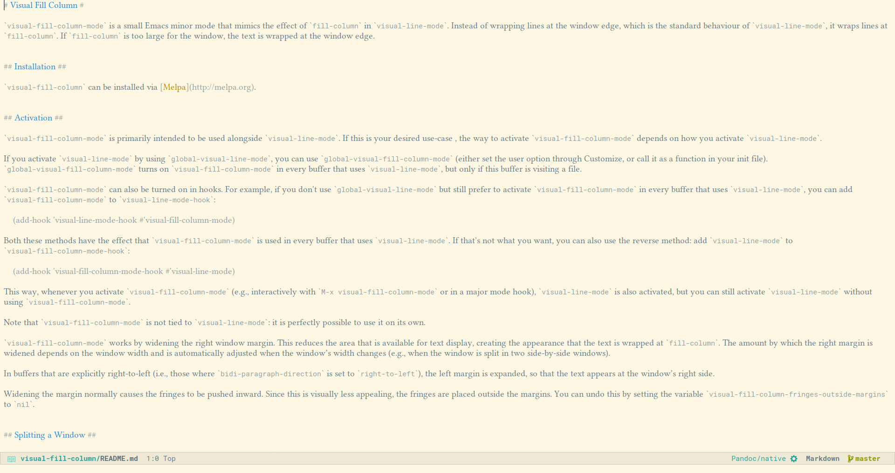
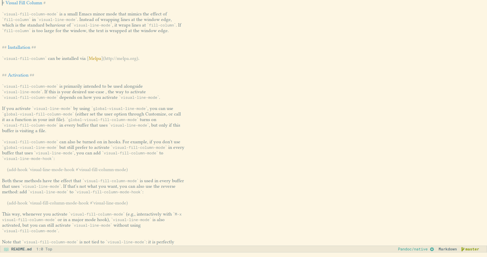

# Visual Fill Column #

`visual-fill-column-mode` is a small Emacs minor mode that mimics the effect of `fill-column` in `visual-line-mode`. Instead of wrapping lines at the window edge, which is the standard behaviour of `visual-line-mode`, it wraps lines at `fill-column`. If `fill-column` is too large for the window, the text is wrapped at the window edge. Told in images, `visual-fill-column` turns the view on the left into the view on the right, without changing the contents of the file:

 Without `visual-fill-column`     | With `visual-fill-column`
--------------------------------- | -------------------------------
  | 

## Installation ##

`visual-fill-column` can be installed via [Melpa](http://melpa.org).

## Usage ##

`visual-fill-column-mode` is primarily intended to be used alongside `visual-line-mode`. If this is your desired use-case , the way to activate `visual-fill-column-mode` depends on how you activate `visual-line-mode`.

If you activate `visual-line-mode` by using `global-visual-line-mode`, you can use `global-visual-fill-column-mode` (either set the user option through Customize, or call it as a function in your init file). `global-visual-fill-column-mode` turns on `visual-fill-column-mode` in every buffer that is visiting a file. (In buffers that do not visit any file, `visual-fill-column-mode` is mostly useless and sometimes even disruptive.)

`visual-fill-column-mode` can also be turned on in hooks. For example, if you don't use `global-visual-line-mode`, but would like to activate `visual-fill-column-mode` in every buffer that uses `visual-line-mode`, you can add `visual-fill-column-mode` to `visual-line-mode-hook`:

    (add-hook 'visual-line-mode-hook #'visual-fill-column-mode)

This method has the effect that `visual-fill-column-mode` is used in every buffer that uses `visual-line-mode`. If that's not what you want, you can also use the reverse method: add `visual-line-mode` to `visual-fill-column-mode-hook`:

    (add-hook 'visual-fill-column-mode-hook #'visual-line-mode)

This way, whenever you activate `visual-fill-column-mode` (e.g., interactively with `M-x visual-fill-column-mode` or in a major mode hook), `visual-line-mode` is also activated, but you can still activate `visual-line-mode` without using `visual-fill-column-mode`.

Note that while `visual-fill-column-mode` was written with the purpose of wrapping text in buffers using `visual-line-mode`, it is not tied to  `visual-line-mode`: it is perfectly possible to use `visual-fill-column-mode` on its own.

`visual-fill-column-mode` works by widening the right window margin. This reduces the area that is available for text display, creating the appearance that the text is wrapped at `fill-column`. The amount by which the right margin is widened depends on the window width and is automatically adjusted when the window’s width changes (e.g., when the window is split in two side-by-side windows).

In buffers that are explicitly right-to-left (i.e., those where `bidi-paragraph-direction` is set to `right-to-left`), the left margin is expanded, so that the text appears at the window’s right side.

Widening the margin normally causes the fringes to be pushed inward. Since this is visually less appealing, the fringes are placed outside the margins. You can undo this by setting the variable `visual-fill-column-fringes-outside-margins` to `nil`.

## Splitting a Window ##

Emacs won’t vertically split a window (i.e., into two side-by-side windows) that has wide margins. As a result, displaying buffers such as `*Help*` buffers, `*Completion*` buffers, etc., won’t split a window vertically, even if there appears to be enough space for a vertical split. This is technically not problematic, but it may be undesirable from a user's point of view. To remedy this, you can set the option `visual-fill-column-enable-sensible-window-split`. When this option is set, the variable `split-window-preferred-function` is set to the function `visual-fill-column-split-window-sensibly`, which first removes the margins and then calls `split-window-sensibly` to do the actual splitting.

This option does not affect the ability to split windows manually. Even if you keep `visual-fill-column-enable-sensible-window-split` unset, you can still split a window into two side-by-side windows by invoking e.g., `split-window-right` (`C-x 3`).

Note that this option replaces the option `visual-fill-column-inhibit-sensible-window-split`. This option was unset by default, causing `split-window-preferred-function` to be set, which had the unfortunate side effect that it would overwrite a user-defined setting for that variable without warning.

To get the old behaviour back, simply customise the option `visual-fill-column-enable-sensible-window-split` or set it to `t` in your init file.

## Adjusting Text Size ##

The width of the margins is adjusted for the text size: larger text size means smaller margins. However, interactive adjustments to the text size (e.g., with `text-size-adjust`) cannot be detected by `visual-fill-column-mode`, therefore if you adjust the text size while `visual-fill-column-mode` is active, the margins won't be adjusted. To remedy this, you can force a redisplay, e.g., by switching buffers, by splitting and unsplitting the window or by calling `redraw-display`.

Alternatively, you can advise the function `text-size-adjust` with the function `visual-fill-column-adjust`:

    (advice-add 'text-scale-adjust :after #'visual-fill-column-adjust)

## Customisation ##

The customisation group `visual-fill-column` has five options (beside `global-visual-fill-column-mode`) that can be used to customise `visual-fill-column`:

`visual-fill-column-width`: column at which to wrap lines. If set to `nil` (the default), use the value of `fill-column` instead.

`visual-fill-column-center-text`: if set to `t`, centre the text area in the window. By default, the text is displayed at the window’s (left) edge, mimicking the effect of `fill-column`.

`visual-fill-column-extra-text-width`: extra columns added to the left and right side of the text area. This should be a cons cell of two integers `(<left> . <right>)`. If `visual-fill-column-center-text` is `t`, the text area is centred before the extra columns are added. This is currently used by `writeroom-mode` to add room for line numbers without shifting the text off-centre.

`visual-fill-column-fringes-outside-margins`: if set to `t`, put the fringes outside the margins.

These four options are buffer-local, so the values you set in your init file are default values. They can also be set in mode hooks or directory or file local variables in order to customise particular files or file types.

The fifth option, `visual-fill-column-inhibit-sensible-window-split` can be set to keep `visual-fill-column-mode` from setting `split-window-preferred-function`, as discussed above.

`visual-fill-column-mode` also binds several mouse events for the left and right margins, so that scrolling or clicking on the margins does what you'd expect (rather than cause an "event not bound" error). If you wish to adjust these bindings, you should do so in `visual-fill-column-mode-map`.
